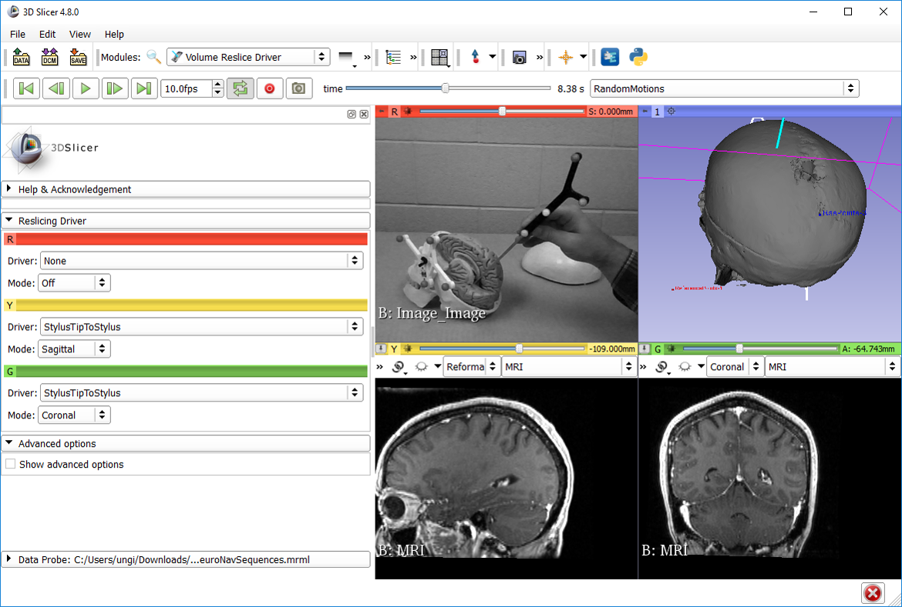

# SlicerIGSIO

SlicerIGSIO is developed as part of the [IGSIO (Image Guided Surgery InterOperability)](http://igsio.github.io/) organization.

## Overview

SlicerIGSIO is an extension for [3D Slicer](http://slicer.org) designed to provide access to [IGSIO tools and algorithms](https://github.com/IGSIO/IGSIO).

## Modules

- ### SequenceIO
  This module provides access to classes for reading, writing, editing, re-encoding, and playback of video container files.
  Users can drag and drop video files into Slicer, allowing playback using Sequences (https://github.com/SlicerRt/Sequences), provided that the video container is one of the supported file types (see below), and that the video track encoding matches one of the registered vtkStreamingVolumeCodecs within Slicer.

  - Supported file types:
    - MKV (Matroska Multimedia Container)
  
- ### Volume Reconstructor
  This module can perform volume reconstruction from tracked volume sequences.

## User guides

- ### SequenceIO
  To load an image sequence file containing transform and/or tool status metadata, drag and drop a file using the ".igs.*" compound extension into Slicer. This extension indicates that the sequence file contains tracked frame information (Ex. [MetaImageSequenceIOTest1.igs.mhd]( https://github.com/IGSIO/IGSIO/blob/master/Source/SequenceIO/Testing/Data/MetaImageSequenceIOTest1.igs.mhd)).
  
  MKV video files can also be opened in 3D Slicer provided that the relevant codec is installed (See codecs included with SlicerIGSIO below)

## Video Codecs
The following video compression codecs are included with the SlicerIGSIO extension:
- VP9 ([Wikipedia](https://en.wikipedia.org/wiki/VP9))

## Support

If you encounter any issues or have any questions, feel free to submit an issue [here](https://github.com/IGSIO/SlicerIGSIO/issues/new).
