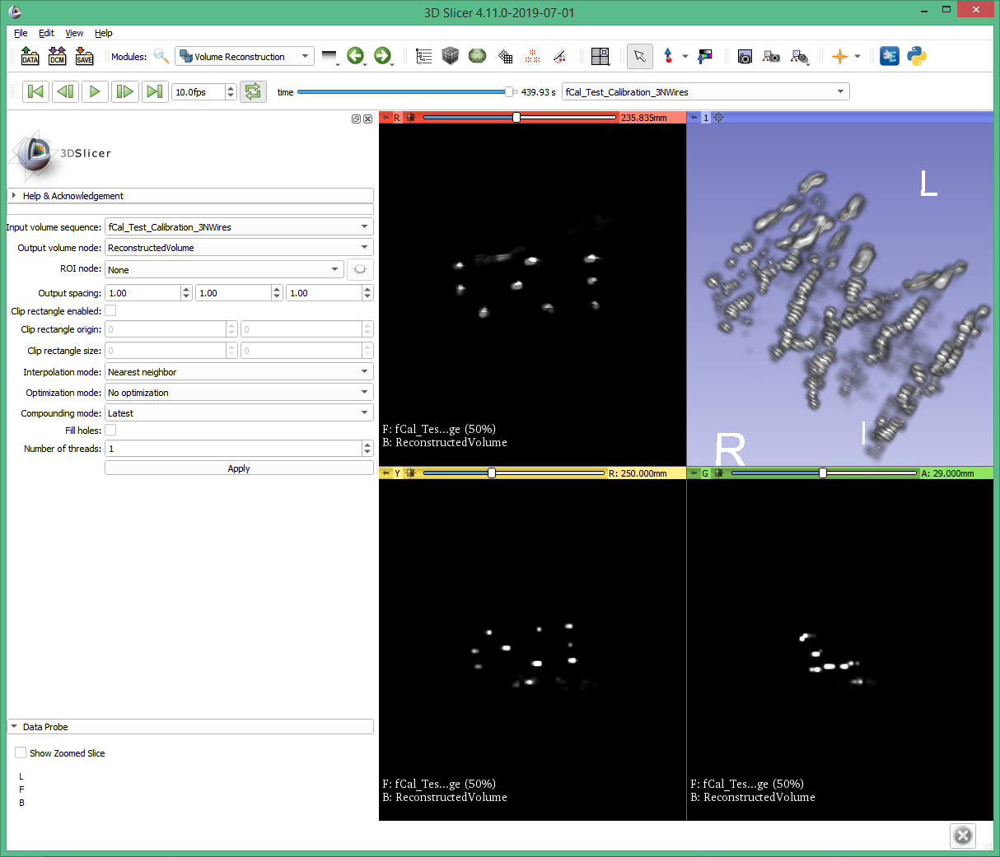

# SlicerIGSIO

SlicerIGSIO is developed as part of the [IGSIO (Image Guided Surgery InterOperability)](http://igsio.github.io/) organization.

## Overview

SlicerIGSIO is a utility extension for [3D Slicer](http://slicer.org) designed to provide access to [IGSIO tools and algorithms](https://github.com/IGSIO/IGSIO)  within 3D Slicer. It should not be installed directly by end users.

## Modules

- ### VideoIO
This module provides access to classes for reading, writing, editing, re-encoding, and playback of video container files.
Users can drag and drop video files into Slicer, allowing playback using Sequences (https://github.com/SlicerRt/Sequences), provided that the video container is one of the supported file types (see below), and that the video track encoding matches one of the registered vtkStreamingVolumeCodecs within Slicer.

- Supported file types:
  - MKV (Matroska Multimedia Container)
  

## User guides

As a utility extension, SlicerIGSIO has no end-user components, and is intended to be used by other extensions such as SlicerIGT.
SlicerIGT tutorials can be found [here](http://www.slicerigt.org/wp/user-tutorial/).

## Support

If you encounter any issues or have any questions, feel free to submit an issue [here](https://github.com/IGSIO/SlicerIGSIO/issues/new).
